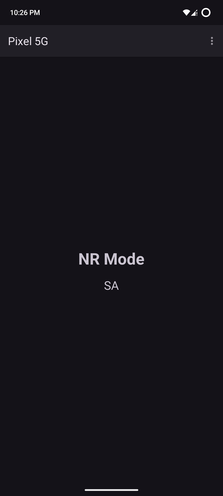
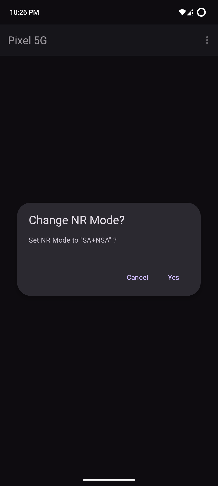
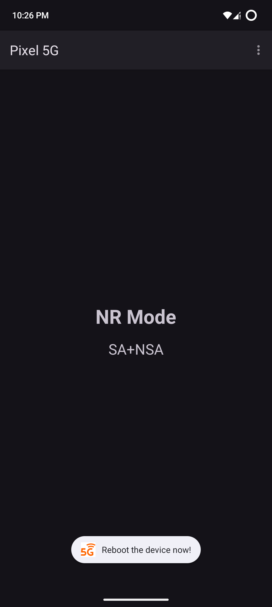

# Pixel 5G

In some countries, Pixel doesn't allow you to connect 5G NSA network  
The default NR config is SA only  

But with this app and root access you can change the modem NR mode to NSA or event better SA+NSA  

    

This app works only on Pixel with samsung modem (Pixel 6-9)
